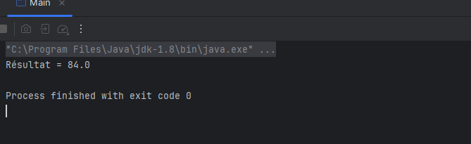

# 🧪 TP – Injection de Dépendances avec Spring (XML)

---

## 🎯 Objectif du TP

Dans ce TP, j’ai exploré un concept fondamental du développement d’applications Java modernes : **l’injection de dépendances**, aussi appelée **Inversion of Control (IoC)**.  
L’objectif principal est de comprendre comment **séparer la création des objets de leur utilisation**, afin de **réduire le couplage** entre les différentes parties d’une application.

J’ai utilisé **Spring Framework** pour automatiser cette injection, en me basant sur un fichier de configuration XML (`config.xml`). Cela permet à Spring de gérer l’instanciation et l’assemblage des objets nécessaires à l’exécution de l’application.

---

## 🛠️ Structure de l'application

L'application a été organisée en différentes couches, chacune jouant un rôle bien défini :

| Élément        | Description |
|----------------|-------------|
| **IDao**       | Interface représentant la couche d’accès aux données. |
| **DaoImpl**    | Une implémentation concrète de `IDao`, retournant une valeur fixe (42) pour simuler un accès aux données. |
| **IMetier**    | Interface représentant la couche métier, où la logique de traitement est définie. |
| **MetierImpl** | Classe métier qui dépend de `IDao` pour exécuter un calcul. La dépendance est injectée via un **setter**. |
| **Main**       | Classe principale qui crée un **contexte Spring**, lit les définitions de beans depuis `config.xml`, et appelle la méthode `calcul()`. |

Cette séparation permet une **meilleure organisation du code** et une **plus grande flexibilité** dans les tests ou la maintenance.

---

## 🔄 Principe de fonctionnement

Voici le **fonctionnement global** de l’application :

1. Dans le fichier `config.xml`, j’ai défini deux **beans** :
   - Le bean `dao` qui représente l’objet `DaoImpl`.
   - Le bean `metier`, qui dépend de `dao`. L’injection est réalisée via une méthode **setter**, sans avoir à instancier manuellement l’objet dans le code.

2. Dans la classe `Main`, j’ai utilisé la classe `ClassPathXmlApplicationContext` pour charger le fichier de configuration et créer automatiquement les objets selon la configuration XML.

3. Une fois le contexte chargé, j’ai pu récupérer l’objet métier (metier) depuis le conteneur Spring, et exécuter la méthode `calcul()`.

Ce mécanisme permet de **changer facilement de DAO ou de logique métier**, simplement en modifiant le fichier XML, sans toucher au code Java.

---

## 🧪 Résultat obtenu

Lorsque j’exécute le programme, le résultat affiché provient du calcul réalisé par `MetierImpl`, en utilisant la valeur fournie par `DaoImpl`.  
Le **résultat est affiché dans la console** comme suit :

---

## 🧠 Ce que j’ai appris

Ce TP m’a permis de **mieux comprendre** plusieurs notions clés dans le développement orienté objet et les frameworks modernes :

- ✅ Le **principe de l’inversion de contrôle (IoC)** : c’est le framework (Spring) qui crée et injecte les objets, pas le programmeur.
- ✅ L’usage du **fichier XML pour configurer les beans**, ce qui rend le code plus souple et facilement configurable.
- ✅ L’importance de **séparer les responsabilités** (DAO, logique métier, présentation), afin de respecter l’architecture en couches.
- ✅ La possibilité de **tester ou modifier les composants** en changeant uniquement la configuration.

---

## 📌 Conclusion

Ce TP constitue une **étape importante** dans la découverte de **Spring Framework**.  
Il m’a permis de comprendre concrètement comment Spring peut gérer les dépendances entre objets à travers un fichier de configuration XML.  
Grâce à cette approche, j’ai pu :

- Simplifier le code,
- Améliorer la lisibilité,
- Faciliter les évolutions futures.

---
